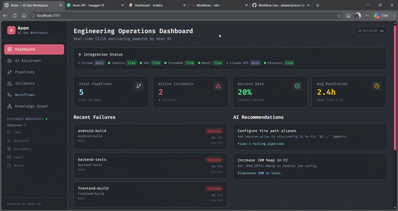

# Aeon — AI-Powered Engineering Operations Workspace

> Every incident your team has ever seen. Every failure that's coming next. One workspace.

**"Odysseus for DevOps"** — an AI ops workspace that combines GitHub Actions, Jenkins, n8n, persistent incident memory (ChromaDB + Neo4j), and a LangGraph agent for CI/CD root cause analysis, automated remediation, and deep research.



---

## What it does

When a build fails, Aeon doesn't just show you the error. It:

1. **Remembers** — searches every incident your team has ever seen using semantic vector search
2. **Diagnoses** — streams live tool calls (fetch logs → search memory → query graph) with per-token SSE
3. **Matches** — "This matches incident #421 from 3 weeks ago · 94% similar"
4. **Acts** — auto-creates GitHub issues, proposes PRs (with human-in-the-loop approval)
5. **Learns** — writes every new analysis back to memory so the AI gets smarter over time

---

## Demo Flow

```
Push to GitHub / Jenkins build runs
        ↓
Aeon Pipelines page shows failure in real time
        ↓
Ask AI: "Why did the Android build fail?"
        ↓
Agent streams live tool calls (search_memory → fetch_logs → query_graph)
        ↓
Root cause identified · 91% confidence
"Matches incident #421 from 3 weeks ago"
Suggested fix included
        ↓
Click "Create Issue"  →  GitHub issue created live
Click "Approve PR"    →  PR created (human in the loop)
        ↓
Switch to Deep Research mode for full incident investigation
Generate post-mortem report (.md download)
        ↓
Open in Odysseus  →  continue research in extended AI workspace
        ↓
Incident stored in memory — AI improves for next time
```

---

## Features

| Feature | Description |
|---|---|
| **AI Assistant** | Streaming LangGraph agent with live tool call log, confidence scores, memory match cards |
| **Deep Research mode** | 15-iteration exhaustive investigation — contributing factors, impact, action items |
| **Post-mortem generator** | One-click incident post-mortem report, copy or download as `.md` |
| **Incident Memory** | ChromaDB semantic search + Neo4j graph relationships across all past incidents |
| **Knowledge Graph** | Force-directed Neo4j visualization — incident → error type → fix relationships |
| **Pipelines** | Unified GitHub Actions + Jenkins view, auto-refresh every 30s, clickable job links |
| **Workflows** | n8n workflow triggers from the dashboard |
| **Action Engine** | Auto GitHub issue creation; PR proposals with approve/reject UI |
| **Odysseus Integration** | Contextual handoff to Odysseus extended workspace — research, chat, documents, notes |

---

## Architecture

```
              Browser  (React + Vite + Tailwind)
                            │
                   FastAPI Backend :8000
                            │
          ┌─────────────────┼──────────────────┐
          ↓                 ↓                  ↓
      GitHub API       Jenkins API        n8n Webhooks
                            │
                   LangGraph Agent
                  (Claude Sonnet 4.6)
                    8 tools · astream()
                            │
              ┌─────────────┴─────────────┐
              ↓                           ↓
           ChromaDB                    Neo4j
       (vector search)          (graph relationships)
              │
     ┌────────┴────────┐
     ↓                 ↓
  Odysseus         PostgreSQL
(extended AI       (incidents)
 workspace)
```

---

## Tech Stack

| Layer | Technology |
|---|---|
| Backend | FastAPI (Python 3.12) |
| LLM | Claude API (`claude-sonnet-4-6`) via AsyncAnthropic streaming |
| Agent | LangGraph — StateGraph, `astream()`, 8 tools |
| Vector Memory | ChromaDB |
| Graph Memory | Neo4j |
| Structured DB | PostgreSQL |
| Cache | Redis |
| Frontend | React 18 + Vite + Tailwind CSS (Fira Code theme) |
| Graph Visualization | react-force-graph-2d |
| CI/CD | Jenkins (Docker) + GitHub Actions |
| Workflow Automation | n8n |
| Extended Workspace | [Odysseus](https://github.com/pewdiepie-archdaemon/odysseus) |
| Deployment | Docker Compose (8 services) |

---

## Quick Start

**Prerequisites:** Docker Desktop, an Anthropic API key.

```bash
# 1. Clone
git clone https://github.com/YOUR_USERNAME/Project-Aeon.git
cd Project-Aeon

# 2. Configure
cp aeon/backend/.env.example aeon/backend/.env
# Edit aeon/backend/.env — set ANTHROPIC_API_KEY at minimum

# 3. Start
cd aeon
docker compose up -d

# 4. Seed demo data
curl -X POST http://localhost:8000/api/memory/seed

# 5. Open
# http://localhost:3000
```

See [SETUP_GUIDE.md](SETUP_GUIDE.md) for the full setup including Jenkins, GitHub Actions, n8n, and Odysseus.

---

## Services

| Service | URL | Default credentials |
|---|---|---|
| **Aeon UI** | http://localhost:3000 | — |
| **Backend API** | http://localhost:8000 | — |
| **API Docs** | http://localhost:8000/docs | — |
| **Jenkins** | http://localhost:8088 | admin / admin |
| **n8n** | http://localhost:5678 | — |
| **Neo4j** | http://localhost:7474 | neo4j / aeon_neo4j |
| **ChromaDB** | http://localhost:8001 | — |
| **Odysseus** | http://localhost:7000 | admin / aeon_demo |

---

## Odysseus Integration

Aeon is built to hand off context to [Odysseus](https://github.com/pewdiepie-archdaemon/odysseus), a self-hosted AI workspace. When Odysseus is running:

- The Aeon sidebar shows an **Extended Workspace** section with a live status dot and links to Odysseus Chat, Research, Documents, Email, and Notes
- After an AI analysis, click **"Research deeper in Odysseus"** to start a Deep Research session pre-filled with the incident query
- On any incident, click **"Research in Odysseus"** to send the root cause as a research query
- After deep research, **"Continue in Odysseus Chat"** opens the Odysseus chat with full context

To run Odysseus alongside Aeon:
```bash
cd odysseus-setup
docker compose up -d
```

---

## LangGraph Agent

```python
tools = [
    search_chromadb_memory,   # semantic search over past incidents
    query_neo4j_graph,        # relationship traversal
    fetch_github_logs,        # GitHub Actions run logs
    fetch_jenkins_logs,       # Jenkins build console output
    create_github_issue,      # auto-create issues
    create_github_pr,         # propose PRs (human approval required)
    trigger_jenkins_build,    # trigger rebuilds
    trigger_n8n_workflow,     # fire n8n automations
]
```

Graph flow:
```
search_memory → call_claude → execute_tools (loop, up to 15×) → synthesize → memory_writer
```

Every analysis is automatically written back to ChromaDB + Neo4j so the agent improves over time.

---

## Project Structure

```
Project-Aeon/
├── aeon/
│   ├── backend/
│   │   ├── api/              REST endpoints
│   │   ├── agents/           LangGraph graph + tools
│   │   ├── core/             Shared singletons
│   │   ├── memory/           ChromaDB + Neo4j stores
│   │   └── services/         GitHub, Jenkins, n8n, Odysseus clients
│   ├── frontend/
│   │   └── src/
│   │       ├── pages/        Dashboard, AIAssistant, Pipelines, Incidents, Workflows, GraphView
│   │       └── components/   Sidebar (with Odysseus section)
│   └── docker-compose.yml    8-service stack
├── odysseus-setup/           Odysseus docker compose + lite Dockerfile
├── jenkins-setup/            Job DSL + seed script
├── github-actions-setup/     5 workflow YAMLs + setup script
├── n8n-setup/                Workflow JSONs + import script
├── SETUP_GUIDE.md            Full setup walkthrough
└── DEMO.md                   90-second demo runbook
```

---

## Key Design Decisions

- **`core/instances.py`** — shared singletons, no duplicate DB connections per request
- **`AsyncAnthropic` + `messages.stream()`** — per-token SSE streamed to the browser
- **`memory_writer_node`** — every analysis auto-stored; the agent gets smarter with every run
- **Human-in-the-loop PRs** — issues auto-create, PRs require explicit approval click
- **Mock fallback everywhere** — full demo works without any external API tokens
- **Odysseus is additive** — Aeon works fully whether or not Odysseus is running
